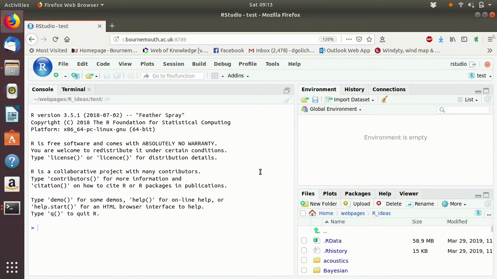
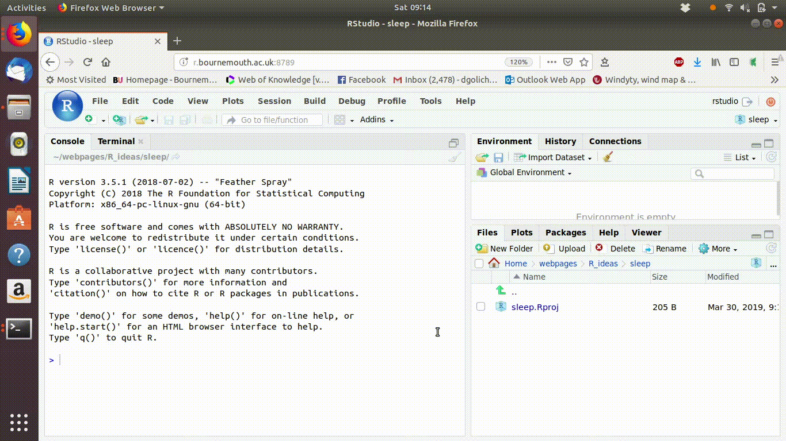
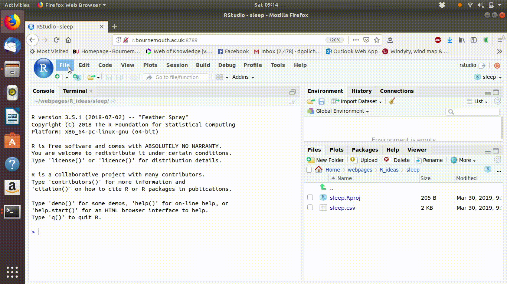
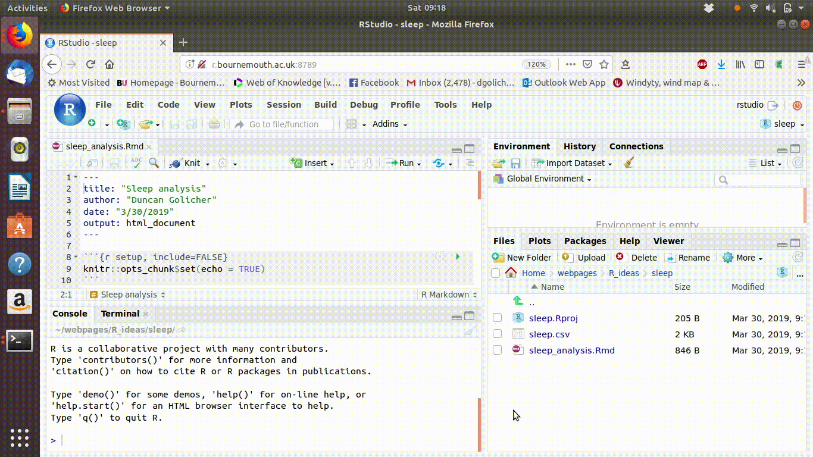
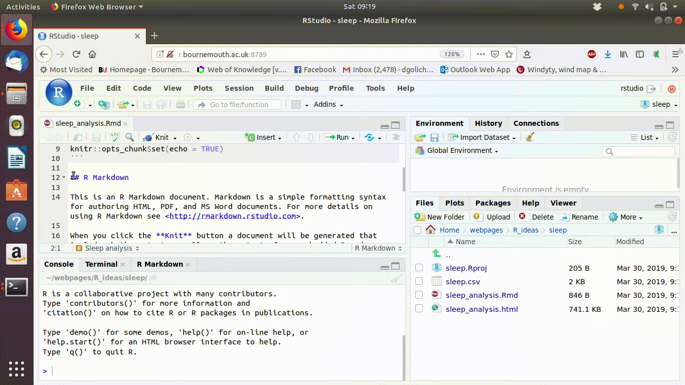
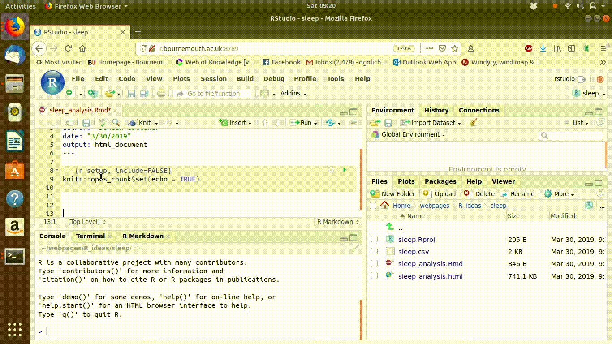
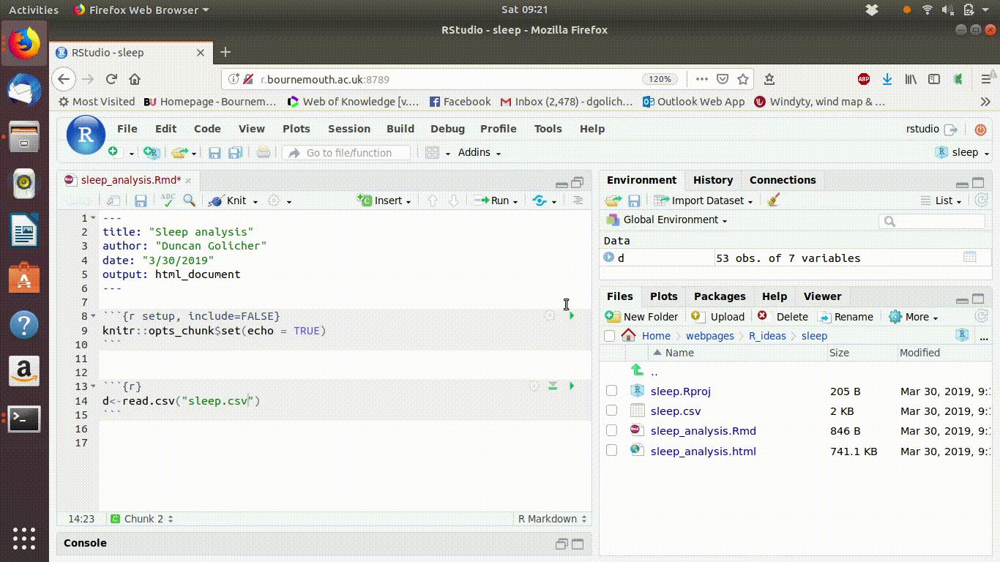
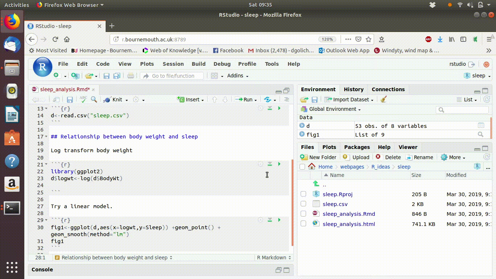
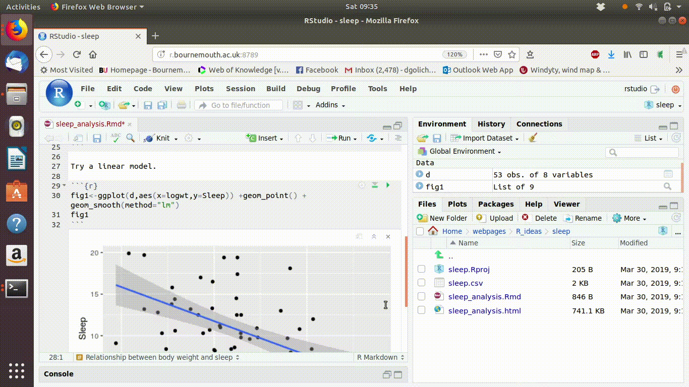

---
output:
  html_document: default
  pdf_document: default
---
# Using the RStudio server

```{r,echo=FALSE}
knitr::opts_chunk$set(echo = FALSE,cache=TRUE)
```


## Introduction

RStudio is a complete environment for working with the R language. Once you have got used to it you will find that it makes working with R far more productive than using the R console version. However some of the concepts involved in using RStudio may be new. 
RStudio provides an interface for working with R code, rather than an interface for running analyses directly. 

## Getting started with the RStudio server

The RStudio server version runs directly through any web browser. **There is no need to install any software on your laptop, PC or tablet**

Access to the server is through the following URL. This works both on and off campus.

http://r.bournemouth.ac.uk:8789/


### Log into the RStudio server

1. Click on the URL http://r.bournemouth.ac.uk:8789/ in a browser. Use Firefox or Chrome.
2. You will see a log in page.
3. Log in using the username and the password you have been provided

## RStudio server concepts

The RStudio server is an integrated platform for doing the following ... 

1. Saving and sharing data files
2. Running analyses
3. Compiling reports
4. Connecting to data stores
5. Sharing analyses with others.

Advanced features can be used without any programming skills through sharing scripts. However you do need to become familiar with some new concepts in order to use the server. 
The RStudio server is ideal for collaborative work. You have your own permanent space on the server for saving your own work and building up a portfolio of useful analyses. Only one person can be logged in at any one time under your username. However I can always log into your user space at any time in order to help correct any errors and to give you advice on the analysis. 

## Finding your way around the interface

Once you are logged in you will see three sections of the interface by default. This will change to four sections when you begin using scripts in the interface.

### Logging on

[](http://r.bournemouth.ac.uk:82/short_courses/Intro_to_RStudio/videos/rstudio_1.mov "Link Title")


Look carefully at the interface and learn to recognise the sections.

1. The RConsole. This is showing up on the left hand side when you first log in. The console can be used for running R code interactively. There is a tab showing up labelled "terminal" as well. You won't use this, as it is for more advanced programming.
2. The environment, history and connections pane is at the top right of the screen. The environment tab is the one that is most used. This tab will show the data that is in the active workspace in R. The concept will only become clear after beginning to use R.  
3. The files, plots, packages, help and viewer tab at the bottom right. The files tab is the most important to understand at this stage. There will be no files in your home directory yet, nor will there be any folders.


## Next steps

[](http://r.bournemouth.ac.uk:82/short_courses/Intro_to_RStudio/videos/rstudio_2.mov "Link Title")

## Navigating through the panes

The console and script panes.

[](http://r.bournemouth.ac.uk:82/short_courses/Intro_to_RStudio/videos/rstudio_3.mov "Link Title")

## Shortcuts

[](http://r.bournemouth.ac.uk:82/short_courses/Intro_to_RStudio/videos/rstudio_4.mov "Link Title")

## More on shortcuts

[](http://r.bournemouth.ac.uk:82/short_courses/Intro_to_RStudio/videos/rstudio_5.mov "Link Title")

## Simple example of how to use the R console

[](http://r.bournemouth.ac.uk:82/short_courses/Intro_to_RStudio/videos/rstudio_6.mov "Link Title")

## Moving data between the Rstudio server and your PC

A key concept to understand when using the server is that your home directory on the server is like a directory (folder) on your PC. In one sense it is rather like the university H drive. 
However the data, the instructions for processing the data and the software (R and R packages) are all "encapsulated" on the server.
So this is different from your H drive, as you cannot run analyses using the standard university server.

In order to move data files and scripts into your home directory within the server you must **upload** them. You will see buttons labelled **New Folder, Upload, Delete, Rename and More**. If you click on the **More** button you will also find an option to **Export** your files. The **upload** and the **export** buttons are frequently used to move files onto the server and to directly move files off the server. It is **very important** to be aware of this concept. Files saved on the server will always be available for use later. In contrast active analyses that take place in the server memory, as opposed to the server's hard disk space, will be temporary and will be lost between sessions.

To see the way data is moved between the server and your PC or laptop watch this video.
Note that the command that you type into the console in order to add the example data set is 

**aqm::add_file()**

[](http://r.bournemouth.ac.uk:82/short_courses/Intro_to_RStudio/videos/rstudio_7.mov "Link Title")

## Loading data into R


It is important to draw a clear distinction between uploading data onto the RStudio server and actually working with data in R. Uploading a data file simply involves moving the file from one place to another. Loading data into R involves turning the data held in the data file into data held in a format R can work with. 

###  The absolute wrong way to load data into R

The video below shows the technique that you might stumble across  yourself if you explore the Rstudio interface.** This is not recomended practice **. I include the example in order to dissuade users from following it. 

[](http://r.bournemouth.ac.uk:82/short_courses/Intro_to_RStudio/videos/rstudio_8.mov "Link Title")

###  A better way to load data into R

The video shows the way data can be loaded by users developing an R script. This is common pracice. It is reproducible, and therefore acceptable. However there is an even better way of working that will be explained in the next section.

[](http://r.bournemouth.ac.uk:82/short_courses/Intro_to_RStudio/videos/rstudio_9.mov "Link Title")


## Using projects in RStudio

You can use Rstudio without opening projects. However, projects make organising your work much simpler. A project is a set of instructions to restore the server to the same state that it was in when you closed the project. So if you are analysing a range of data sets you can use one project per data set to keep your work organised. 

To form a new project and add a new folder

1. Click on the file menu at the top left of the interface.
2. Go to New Project
3. You will see a window with three options to create a project. Choose the first option labelled **New Directory** 
4. The next window will show a range of  advanced options. Ignore them and just select **New Project**
5. You will now see a window with a prompt for the Directory name (and some other options). In this example the project will contain data on sleep in mammals, so "sleep" could be used as the directory name.
6. Click create project
7. Look at the files pane in the bottom right corner. You will now see that after Home there is the word sleep. You can also see a file called sleep.Rproj in the folder.
8. Click on home. You can see a folder called sleep in your home directory. So .. you have created a new project and placed the project file within the folder. 


[](http://r.bournemouth.ac.uk:82/short_courses/Intro_to_RStudio/videos/rstudio_10.mov "Link Title")


```{r,fig.cap="Animated gif showing the steps taken when opening a new project. (Note the gif will be static in a PDF version of this document)"}

if(knitr::is_html_output()) {
  
}
```


## Uploading data


Data files are added to the project using the upload button in the files pane (bottom right). If you want to upload multiple files at once (e.g shapefiles) you should first compress them into a zip file. The zip file will expand when uploaded.

Although R can read data from many different formats, the data files that you upload must be in some form of conventional format. The easiest format to use is to save each table as a single comma separated variable (.csv) file. The first line should contain short variable names with no spaces. The variable definitions should be kept separately and referred to when writing figure labels and captions, but not used in the column headers.

```{r,fig.caption= "Uploading a file into the RStudio server. Use the upload button in the files pane and then browse to the file on your PC or laptop."}

if(knitr::is_html_output()) {
  
}
```

[](http://r.bournemouth.ac.uk:82/short_courses/Intro_to_RStudio/videos/rstudio_11.mov "Link Title")


## Working with markdown documents.

This course will concentrate on the use of markdown documents as a way of running R code. There are many advantages of using markdown.

1. Embedded code can be either revealed to other users to show how the results were obtained or hidden to simply produce a report with embedded figures and statistics.
2. Annotation of the results of an analysis can be embedded around the results to explain the key results.
3. Very limited knowledge of the R language and syntax is necessary to adapt markdown documents in order to analyse your own data.
4. With a little more knowledge and experience of R complex methods can be applied by altering markdown found on-line.

## Forming a markdown document.

1. Go to file on the top menu bar
2. Choose "New file"
3. Choose "R Markdown"
4. You will now see a window in which you can type in a name for the title of your analysis. By default the name is "untitled". Change that to some title that makes sense for the analysis you are going to run. It is easy to change the title later.
5. You will now see an untitled markdown document added to the top pane in RStudio. Rather confusingly it is still untitled, even though you've just typed a title! The reason for this is that the title you typed is used as the first line of the data report, but so far you still have not saved the file as a named document.
6. Click on save to save the report.  Now give the file itself a name.

The steps are shown in the animated gif below


```{r, fig.caption="Forming a new markdown document for a data report. Notice that you need to provide a title which is used as the report heading and name for the file itself."}

if(knitr::is_html_output()) {
  
}
```


Now try pressing the "knit" button on the top right pane. You will see the default demonstration document that was produced as a template "knit" into a simple data report. This is not yet using your data of course.


```{r,fig.cap="Compiling the demonstration markdown document."}

if(knitr::is_html_output()) {
  
}
```


The steps above will always produce the default "demo" markdown document. Every time you start a new markdown Rstudio will start off with this one. 
You should take a look at the logic of the demo document carefully. It consists of "chunks" of R code that produce output in the form of tables and figures embedded in text. The R code automatically produces output and adds it to the document after knitting. So if you have R code available that will run an analysis that you are interested in you don't have to remember any other steps in order to run it. Simply ensure that the data that is being added to the analysis is appropriate for the type of analysis being run and you can obtain the same results with your own data. This will be the way R is used in this course.


```{r,fig.cap="Removing the default text from a new markdown document"}

if(knitr::is_html_output()) {
  
}
```

## Reading in your data

If you are new to R you may be tempted to look around for a button on the RStudio interface to "load" the data file. You won't find one. Although there is a way to load data interactively you really **must not** do this.

```{block, type = "rmdwarn", echo=TRUE}

Always make sure that you include a line of code that loads the data at the start of your R script. Do not load data using the import data feature when building a markdown document. It will not work, as the data will not be loaded when you compile.
```


In this case the working directory that R is using coincides with the project directory. So there is no need to include the path to the data file. This line will read the file into R and assign the data to a data frame called "d". 

```{r,echo=TRUE,eval=TRUE}
library(aqm)
aqm::add_file()

d<-read.csv("sleep.csv")
```

To form a code chunk click on the button on the interface labelled "Insert". Alternatively the keyboard short-cut control alt I will work.  Then type the code very carefully into the chunk. Make sure that the code sits within the body of the chunk and that you do not disturb the dashes that separate the chunk from the rest of the document. 

You should type the line into a single block of code that loads the data. Some  types of data, such as GIS layers or SPSS data files require packages to be loaded first. You should include a code chunk to load these packages first if you need them.

```{block, type = "rmdnote", echo=TRUE}
When conducting an analysis with just a single data frame I often call the data object "d". This is just for brevity. As there are no other data objects present there is no ambiguity. If you load several data frames you should give them more informative names.
```

```{r, fig.cap "Inserting a code chunk to load a data file into a data frame. Notice that clicking the green arrow on the chunk runs the code, which leads to an object called d appearing in the invironment pane"}

if(knitr::is_html_output()) {
  
}
```


When you have finished typing the line of code to load the data, click on the run button of the chunk. You will see a data object appear in the environment pane in the top right corner of the RStudio server. If you click on this object it will open as a spreadsheet like table in the main panel.

```{r,fig.cap="Clicking on the name of the data frame in the Environment tab opens up a spreadsheet like interface to inspect the data"}

if(knitr::is_html_output()) {
  
}
```

## Adding analysis chunks

Once you have the data loaded you can begin to build up an analysis. You should use a separate chunk for each step and write some text between each chunk that explains what you are doing.  Code from the course documents and crib sheets will form the basis for most of your analyses. It is very important to run all the code in the right order. Code chunks often depend on actions that are taken previously. For example in fig \@ref(fig:rstudio10) the animated gif shows that two code chunks have been added after the data were  loaded. The first produces a new variable which is the log transformed body weight. The second inspects the relationship between mean time spent sleeping and the log transformed variable. If the code were not run in order the last chunk would not work. The downward facing button on a code chunk runs all the chunks above it. You should use this frequently in order to check that everything is in the right order.

```{r rstudio10, fig.cap="Building up an analysis in a markdown document. Notice how the run all chunks above button is used to ensure that all the necessary code is being run"}

if(knitr::is_html_output()) {
  
}
```

## Compiling a report

Once you have written all the code needed for your analysis and tested it by stepping through each chunk in the correct order you can compile your report into a document. This whole book has been written and compiled in this way. The idea of using markdown is to ensure that all the code to produce an analysis is reproducible and that the results of the analysis are annotated with comments that explain them both as a reminder to yourself and potentially as a report read by others. 


```{r,fig.cap="Knitting the markdown into an HTML document"}
if(knitr::is_html_output()) {
  
}

```


```{r}
knitr::opts_chunk$set(echo = TRUE)
```

